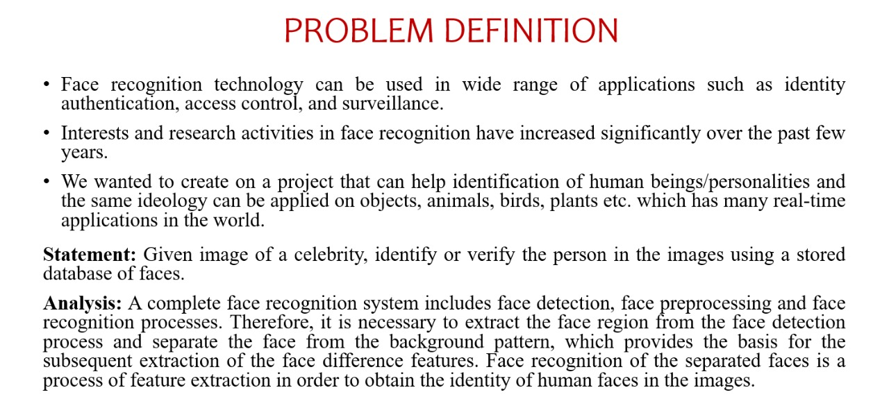
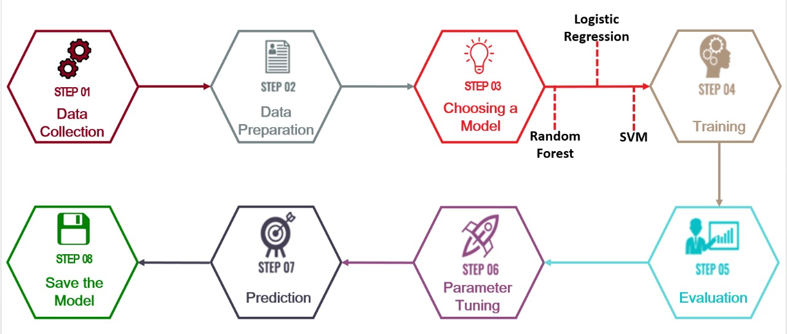
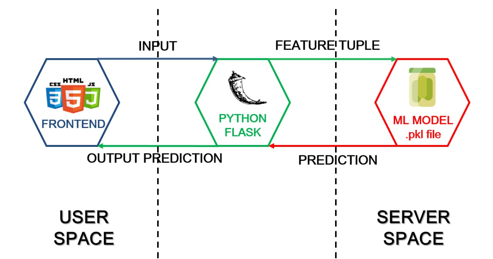
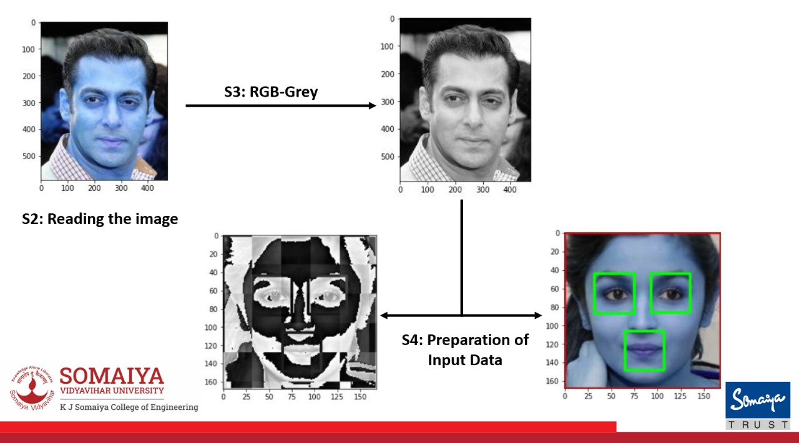
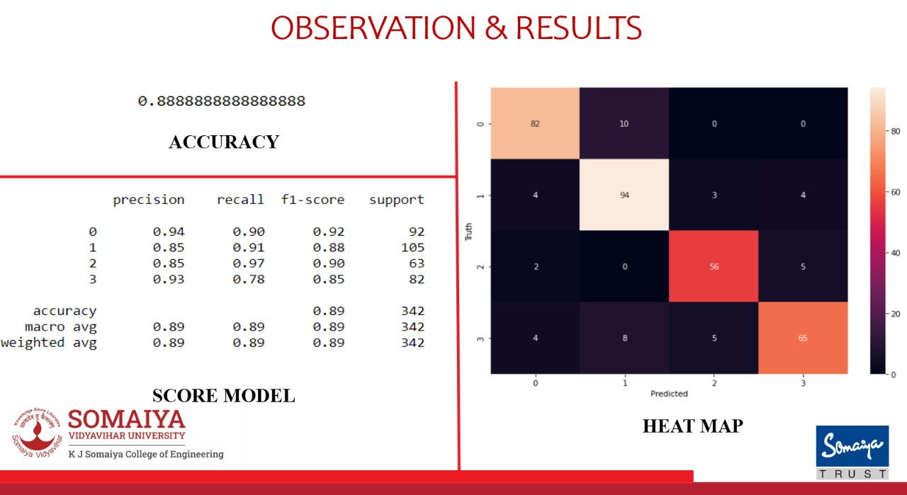
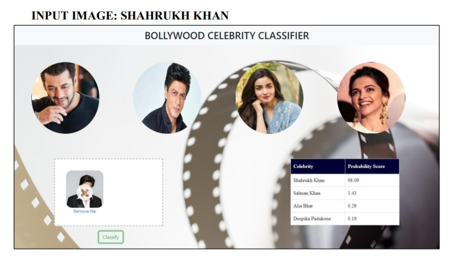
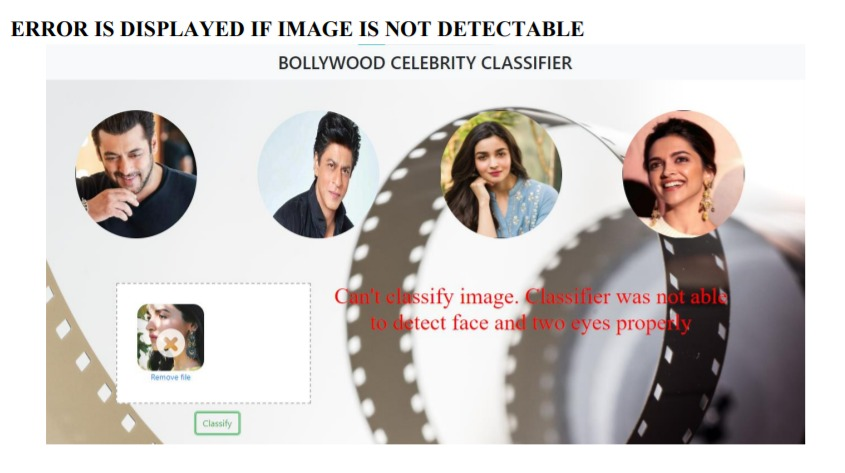
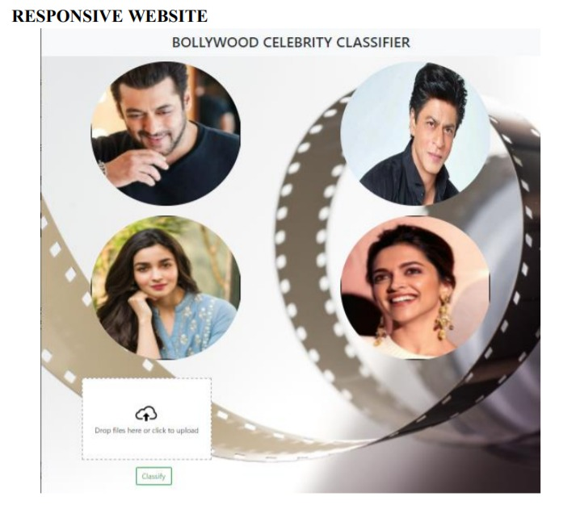

<h1 align="center">Image-Recognition-Website</h1>

<b>Contributors</b>

  
 
  
| Contributors | Sankalp Jain | Babita Rataudi | Suparshwa Patil |
|--------------|--------------|----------------|-----------------|
| </img>|[sankalp-jain-610803193](https://www.linkedin.com/in/sankalp-jain-610803193/)|[babitaratudi](https://www.linkedin.com/in/babitaratudi/)|[suparshwa-patil](https://www.linkedin.com/in/suparshwa-patil/)|
| </img>|[Sankalp679](https://github.com/Sankalp679)|[babitaratudi](https://github.com/babitaratudi)|[suparshwa](https://github.com/suparshwa)|

<b>Technologies and Tools :computer:</b>

 
<code></code>
<code></code>
<code></code>
<code></code>
<code></code>
<code></code>
<code></code>

    

<b>Problem Defination</b>
  
 
</img>
 

<b>Objectives Of Project</b>

 

|    | Objectives Of Project                                                                                                                                    |
|----|------------------------------------------------------------------------------------------------------------------------------------------------------------------------|
| 1. |The user should be able to input a celebrity image on the website to get proper identification.                                                                                                                              |
| 2. |Implementation of machine learning algorithms in real life projects with decent accuracy.                                                                                                         |
| 3. |Extraction of images for training and testing using image scrapper.|
| 4. |Data cleaning, preprocessing of raw dataset.  |
| 5. |Implementation of feature engineering is performed on the raw dataset.                                                                                                                         |
| 6  |Learn how Image classification is done using OpenCV.                                                                                             |
| 7. | Execution of various ML supervised learning classifiers.                                                                                                             |
| 8. |Incorporation of machine learning models on the responsive website.                                                                                                                           |
| 9. | The website should be easily accessible by users with a clean user interface. People from any age should be able to use the website.                                                                                                               |                                                                                                                       |
| 10.|The system should satisfy the requirements precisely to fulfil the end user objectives. |

 

<b>Working Of Facial Recognition</b>
  
 
</img>
 

<b>Work Flow Machine Learning Application</b>
  
 
</img>
 

<b>Backend Development And Implementation</b>
  
 
</img>
 

<b>Implementation Steps</b>

 

|     | Implementation Steps             |
|-----|----------------------------------|
| 1.  | Collection of data               |
| 2.  | Reading image of celebrity       |
| 3.  | Image manipulation with rgb2grey |
| 4.  | Analyse the collected data       |
| 5.  | Preparation of input data        |
| 6.  | Split into train and test sets   |
| 7.  | Training & Testing the algorithm |
| 8.  | Test for different algorithms    |
| 9.  | Analyse the results              |
| 10. | Score model                      |
| 11. | Saved the model                  |
| 12. | server.py                        |
| 13. | scratch.py                       |
| 14. | wavelet.py                       |

 

 

<b>Implementation Flow</b>
  
 
</img>
 

<b>Results And Observations</b>
  
 
</img>
 

<b>Website Snippets</b>

 
 </img> 
</img> 
</img>

   

<b>Problems And Solutions</b></b>
  
 
</img>
 

<b>Future Scope</b>
  
 

|    | Future Scope                                                                                                                                                                                           |
|----|--------------------------------------------------------------------------------------------------------------------------------------------------------------------------------------------------------|
| 1. | The idea of project can be used for recognizing criminals from the database of police.                                                                                                                 |
| 2. | The idea of the project can be extended to Historical figures/personalities or Hollywood celebrities in addition with Bollywood celebrities.                                                           |
| 3. | The idea of project can be used for educational purposes in museums.                                                                                                                                   |
| 4. | The idea can even be extended to animal hospitals, agriculture-based industries to detect agro based products, breed of animals, flowers and related details effectively which may save a lot of time. |
| 5. | It can be implemented for bio-medical report identification.                                                                                                                                           |
| 6. | This project can be updated to identify multiple faces in a single photo and provide the corresponding results for all the detected faces.                                                             |
| 7. | Face Authentication can also be implemented for security purposes as well as for general use like attendance for colleges, meetings etc.                                                               |

 

  
  

